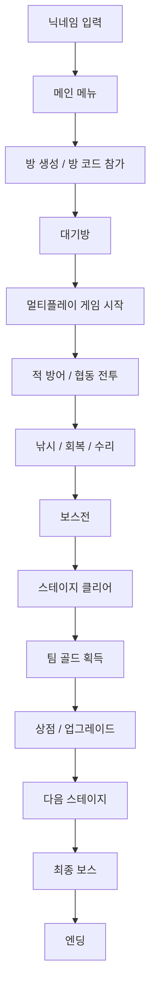

<div align="center">

# 🏴‍☠️ Pirate Defense

### C++ · SFML · TCP/IP 기반 멀티플레이 협동 디펜스 게임

[]()
[]()
[]()
[]()
[]()
[]()

**여러 플레이어가 하나의 해적선을 함께 지키며 적과 보스를 막아내는**  
**TCP/IP 기반 멀티플레이 협동 디펜스 게임**입니다.

</div>

---

## 📌 프로젝트 개요

**Pirate Defense**는  
플레이어들이 하나의 선박을 함께 방어하며 스테이지를 클리어하는  
**협동형 멀티플레이 디펜스 게임**입니다.

이 프로젝트는 단순한 싱글 게임이 아니라,

- **방 생성 / 방 코드 참가**
- **TCP/IP 기반 실시간 멀티플레이**
- **실시간 채팅**
- **낮 · 저녁 · 밤 시간대 변화**
- **야간 시야 제한**
- **상점 / 업그레이드 / 낚시 / 팀 자원 시스템**

까지 포함한 **하나의 완성형 게임 흐름**을 목표로 개발했습니다.

---

## 🎯 프로젝트 목표

이 프로젝트의 핵심 목표는 다음과 같습니다.

- **C++ 기반 게임 로직 구현**
- **SFML을 활용한 그래픽/UI 시스템 구성**
- **TCP/IP 소켓 기반 멀티플레이 구현**
- **실시간 게임 상태 동기화**
- **팀 프로젝트 기반 기능 분담 및 코드 통합**
- **하나의 완성된 협동 게임 시스템 구현**

---

## 💡 프로젝트 배경

본 프로젝트는 **5인 팀 프로젝트**로 진행한  
**C++ / SFML / TCP/IP 기반 멀티플레이 협동 디펜스 게임**입니다.

단순히 기능별 미니 구현에 그치지 않고,

> **방 생성 → 멀티플레이 참가 → 실시간 동기화 → 협동 전투 → 성장 → 다음 스테이지**

로 이어지는 실제 게임 흐름을 만들고자 했습니다.

특히 **팀장을 맡아 전체 시스템 구성과 코드 통합을 담당**했으며,  
각 팀원이 구현한 기능을 하나의 게임 프로젝트로 연결하는 데 집중했습니다.

---

## 🧰 개발 환경 / 기술 스택

| 구분 | 사용 기술 |
|---|---|
| **Language** | C++ |
| **Graphics / UI** | SFML |
| **Network** | TCP/IP Socket Programming |
| **Architecture** | Client / Server |
| **IDE** | Visual Studio 2022 |
| **Platform** | Windows |

---

## 👥 팀 구성

### **김초아 (팀장)**  
**Network / Main System / UI / Integration**

- TCP/IP 네트워크 연동
- 실시간 채팅 시스템
- 메인 SFML 시스템 구현
- 코드 통합
- 야간 시야 제한
- 게임 UI 및 전체 디자인

---

| 팀원 | 담당 영역 | 주요 구현 내용 |
|---|---|---|
| 박지수 (부팀장) | Item / Shop / Player Attack | 아이템 시스템, 상점 시스템, 플레이어 공격 기능 구현 |
| 김상원 (팀원) | Enemy / Stage / Damage | 적 캐릭터, 적 공격 패턴, 스테이지, 피해 처리 시스템 구현 |
| 김승환 (팀원) | Game Structure / Presentation | 게임 기본 구조 및 전체 틀 구현, 발표용 PPT 제작 |
| 유동호 (팀원) | Player / HP / Fishing | 플레이어 캐릭터, 캐릭터 HP 시스템, 낚시 기능 구현 |

---

## 👑 Team Leader & My Contribution

본 프로젝트에서 **김초아는 팀장으로서 프로젝트 전체 시스템 구성과 코드 통합을 담당**했습니다.

### ✅ 담당 역할

- **TCP/IP 네트워크 연동**
- **실시간 채팅 시스템 구현**
- **메인 SFML 시스템 구현**
- **팀원 코드 통합**
- **야간 시야 제한 구현**
- **게임 UI 및 전체 디자인 구성**

### ✅ 주요 구현 내용

#### 1) TCP/IP Network
- 방 생성 / 참가
- 플레이어 연결 관리
- 플레이어 입력 송수신
- 게임 상태 동기화
- Host 중심 멀티플레이 구조 구현

#### 2) Real-Time Chat
- 실시간 채팅 송수신
- 닉네임 기반 메시지 출력
- Tab 키 기반 채팅 입력
- Windows IME 기반 한글 입력 지원

#### 3) Main SFML System
- 닉네임 입력 화면
- 메인 메뉴
- 방 생성 / 참가
- 대기방
- 싱글 / 멀티플레이 화면 전환
- 이벤트 및 입력 처리 통합

#### 4) System Integration
- 팀원별 기능을 메인 프로젝트에 통합
- 게임 루프와 네트워크 구조 연결
- 상점 / 전투 / 낚시 / 적 시스템 연동
- 프로젝트 전체 실행 구조 정리

#### 5) Night Vision
- 밤 스테이지 시야 제한
- 플레이어 중심 가시 범위 렌더링
- 시간대 변화에 따른 분위기 연출

#### 6) UI / Design
- 메인 메뉴 UI
- 게임 HUD
- 채팅 UI
- 안내창 / 상점 UI
- 전체 화면 구성 및 게임 디자인 통합

---

## ✨ 주요 기능

### 🏠 1. 방 생성 / 참가
- 멀티플레이 방 생성
- 랜덤 방 코드 발급
- 방 코드를 통한 참가
- 닉네임 기반 입장

### 🌐 2. 실시간 멀티플레이
- TCP/IP 기반 네트워크 통신
- 플레이어 입력 동기화
- 게임 상태 실시간 동기화
- Host 중심 구조

### 💬 3. 실시간 채팅
- 게임 중 채팅 가능
- 닉네임과 함께 출력
- 한글 / 영문 입력 지원

### ⚔️ 4. 협동 디펜스 전투
- 여러 플레이어가 하나의 선박 공동 방어
- 적 및 보스 등장
- 플레이어 공격 / 수리 / 회복 분담

### 🌊 5. 스테이지 시스템
- 총 **6개 스테이지**
- 바다 / 섬 테마 구성
- 스테이지별 보스전 존재
- 난이도 점진 상승

### ☀️ 6. 시간대 변화
- 낮 → 저녁 → 밤
- 게임 분위기 변화
- 밤 시야 제한 적용

### 🎣 7. 낚시 시스템
- 물고기 획득
- 체력 회복
- 팀 자원 활용

### 💰 8. 팀 골드 / 상점 시스템
- 스테이지 클리어 시 팀 골드 지급
- 아이템 구매
- 업그레이드
- 팀원 투표 기반 구매 시스템

### 🔫 9. 다양한 포탄
- 확산탄
- 관통탄
- 폭발탄
- 화염탄
- 중포탄

---

## 🔄 시스템 흐름도



---

## 🕹️ 게임 진행 흐름

```text
닉네임 설정
   ↓
메인 화면
   ↓
싱글 / 멀티플레이 선택
   ↓
방 생성 / 방 코드 참가
   ↓
대기방
   ↓
게임 시작
   ↓
낮 Wave
   ↓
저녁 Wave
   ↓
밤 Wave
   ↓
보스전
   ↓
스테이지 클리어
   ↓
팀 골드 획득
   ↓
상점 / 업그레이드
   ↓
다음 스테이지
   ↓
최종 보스
   ↓
엔딩
```

---

## 🌙 시간대 변화 시스템

| 시간대 | 특징 |
|---|---|
| **낮** | 기본 시야, 안정적인 플레이 |
| **저녁** | 분위기 변화, 전투 긴장감 증가 |
| **밤** | 시야 제한 적용, 플레이어 주변만 확인 가능 |

---

## 🎮 조작법

| 키 | 기능 |
|---|---|
| **W / A / S / D** | 이동 |
| **Space** | 공격 |
| **C** | 근접 공격 |
| **E** | 상호작용 / 낚시 |
| **Q** | 아이템 사용 / 버리기 |
| **Tab** | 채팅 입력 활성화 |
| **F1** | 도움말 |
| **F10 / ESC** | 메뉴 복귀 / 종료 관련 동작 |
| **숫자키** | 포탄 / 상점 선택 |

---

## 🧱 프로젝트 구조

```text
Pirate-Defense
│
├── README.md
│
└── PirateDefense/
    │
    ├── assets/
    │   └── 게임 이미지 및 리소스
    │
    ├── Items/
    │   └── 아이템 관련 리소스
    │
    ├── Runtime/
    │   ├── PirateDefense.exe
    │   └── 실행에 필요한 DLL
    │
    ├── EndingCutscene.hpp
    ├── Game.hpp
    ├── ItemSystem.hpp
    │
    ├── main.cpp
    │
    ├── MultiGame.cpp
    ├── MultiGame.h
    │
    ├── NetworkManager.cpp
    ├── NetworkManager.h
    │
    ├── Render.hpp
    │
    ├── SingleGame.cpp
    ├── SingleGame.h
    │
    ├── SpriteAnimation.hpp
    │
    ├── PirateDefense.sln
    ├── PirateDefense.vcxproj
    ├── PirateDefense.vcxproj.filters
    │
    ├── .gitignore
    ├── SFML-license.md
    └── run.cmd
```

---

## 💻 주요 담당 코드

### `NetworkManager.h`
- 네트워크 시스템 구조
- TCP/IP 데이터 정의
- 서버 / 클라이언트 관리

### `NetworkManager.cpp`
- 서버 / 클라이언트 연결
- 방 생성 / 참가
- 채팅 송수신
- 플레이어 데이터 동기화
- 게임 상태 동기화

### `main.cpp`
- 메인 SFML 시스템
- 닉네임 입력
- 메인 메뉴
- 방 생성 / 참가 화면
- 대기방
- 채팅 입력 처리
- 화면 상태 전환

### `MultiGame.cpp`
- 네트워크와 실제 멀티플레이 게임 루프 연결
- 플레이어 입력 송수신
- 멀티플레이 게임 상태 반영
- 전체 시스템 통합

### `Render.hpp`
- HUD 렌더링
- 채팅 UI
- 게임 정보 출력
- 야간 시야 제한 효과

> 소스 코드 내부에서 **`[김초아 담당]`** 주석을 검색하면  
> 담당한 핵심 구현 위치를 빠르게 확인할 수 있습니다.
---

## 🚀 빌드 및 실행

### 1. 개발 환경
- Windows
- Visual Studio 2022
- SFML

### 2. 실행 방법
1. `PirateDefense.sln` 파일을 Visual Studio에서 엽니다.
2. 빌드 구성을 확인합니다.
3. 프로젝트를 빌드합니다.
4. 실행 시 필요한 리소스와 DLL이 포함된 `Runtime` 폴더를 함께 유지합니다.

또는

- `Runtime/PirateDefense.exe` 직접 실행
- `run.cmd`를 통한 실행

---

## 🎯 핵심 성과

이 프로젝트를 통해 다음 내용을 실제로 구현하고 경험했습니다.

- **C++ 기반 게임 로직 설계**
- **SFML UI / 렌더링 시스템 구현**
- **TCP/IP Socket Programming**
- **Client / Server 멀티플레이 구조**
- **실시간 채팅 시스템 구현**
- **실시간 게임 상태 동기화**
- **여러 개발자의 코드 통합**
- **팀장으로서 프로젝트 구조 관리 및 기능 연동**

특히 **팀장으로서 각 팀원의 기능을 하나의 시스템으로 연결하고**,  
실제로 동작하는 **멀티플레이 협동 게임**으로 완성했다는 점이 가장 큰 성과입니다.

---

## 📎 라이선스

본 저장소에는 SFML 사용과 관련된 `SFML-license.md` 파일이 포함되어 있습니다.

프로젝트 소스 및 사용 범위는 팀 프로젝트 기준에 따릅니다.
